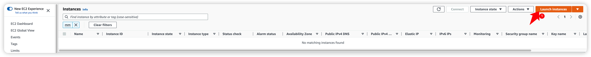
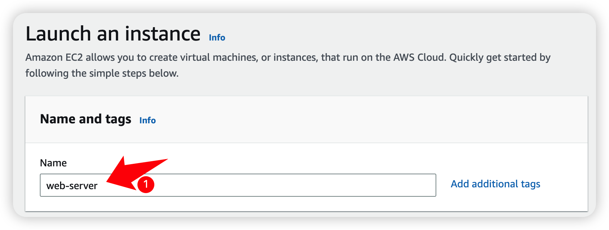
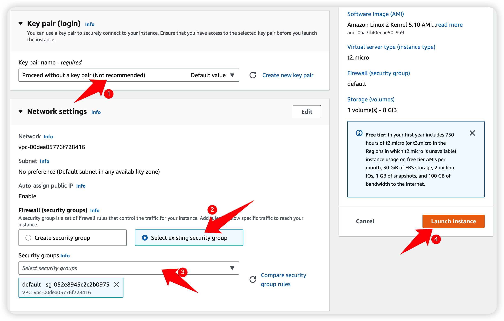
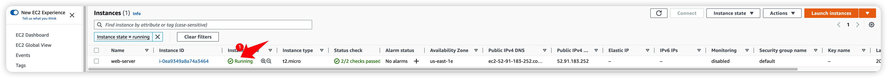
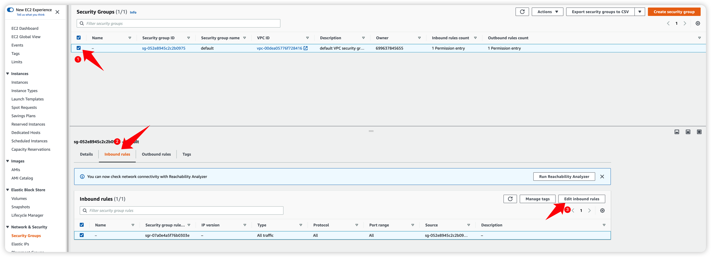
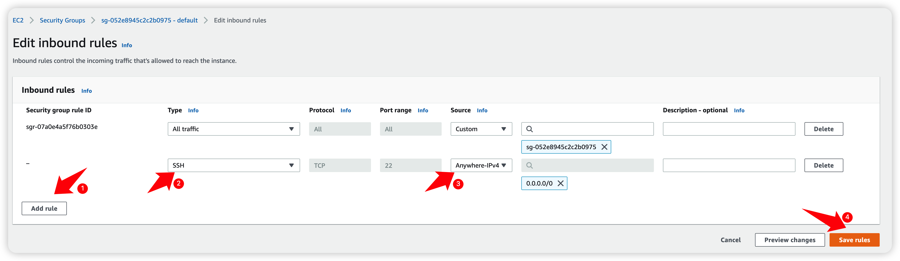
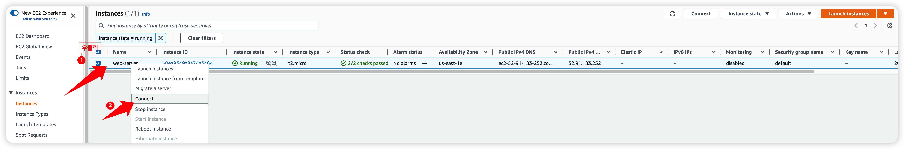
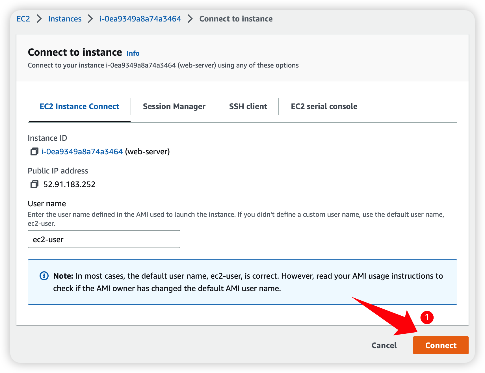

# 1. 개요
Nginx의 Log를 수집하여 Glue Streaming을 통해 실시간으로 s3로 전송하는 것을 목적으로 합니다.

# 2. 기능
...

# 3. 아키텍처

## 1. WEB 서버 생성
***
1. ec2 페이지로 이동[(바로가기)](https://ap-northeast-2.console.aws.amazon.com/ec2/home?region=ap-northeast-2#Instances)하여 WEB서버를 생성합니다.

***
1. Name 에 `web-server` 를 입력합니다.

***
1. Key pair 에 `Proceed without a key pair` 를 선택
2. Network setting 에서 Firewall 에 `Select existing security group` 선택
3. Security groups 에 `default` 체크
4. `Launch instance` 버튼을 누릅니다.

***
1. ec2 페이지로 이동[(바로가기)](https://ap-northeast-2.console.aws.amazon.com/ec2/home?region=ap-northeast-2#Instances)하여 방금 생성한 web-server의 instance state가 Running 상태가 될 때까지 기다립니다.

***

생성된 ec2 의 ssh 접근을 위해 보안 그룹 페이지로 이동[(바로가기)](https://us-east-1.console.aws.amazon.com/ec2/home?region=us-east-1#SecurityGroups:) 합니다.
1. Securty group name 이 `default`인 보안 그룹 체크
2. 하단의 `inbound rules` 탭을 클릭
3. `Edit inbound rules` 를 클릭합니다.

***

Edit inbound rules 화면에서
1. `Add rule` 버튼 클릭
2. Type 에 `ssh` 선택
3. Source 에 `Anywhere-IPv4` 를 선택
4. `Save rules` 버튼을 클릭합니다.

***

다시 ec2 페이지로 이동[(바로가기)](https://ap-northeast-2.console.aws.amazon.com/ec2/home?region=ap-northeast-2#Instances) 이동하여 
1. `web-server` ec2 에서 우클릭
2. `Connect` 를 선택합니다.

*** 

Connect to instance 화면에서 `Connect` 를 클릭하여 SSH 접속을 합니다.
