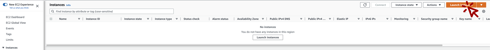

# 1. 개요
Nginx의 Log를 수집하여 실시간으로 s3로 전송하는 것을 목적으로 합니다.

# 2. 기능

# 3. 설계

## 1. WEB 서버 생성
ec2 생성 페이지로 이동[(바로가기)](https://ap-northeast-2.console.aws.amazon.com/ec2/home?region=ap-northeast-2#Instances)하여 WEB서버를 생성합니다.
