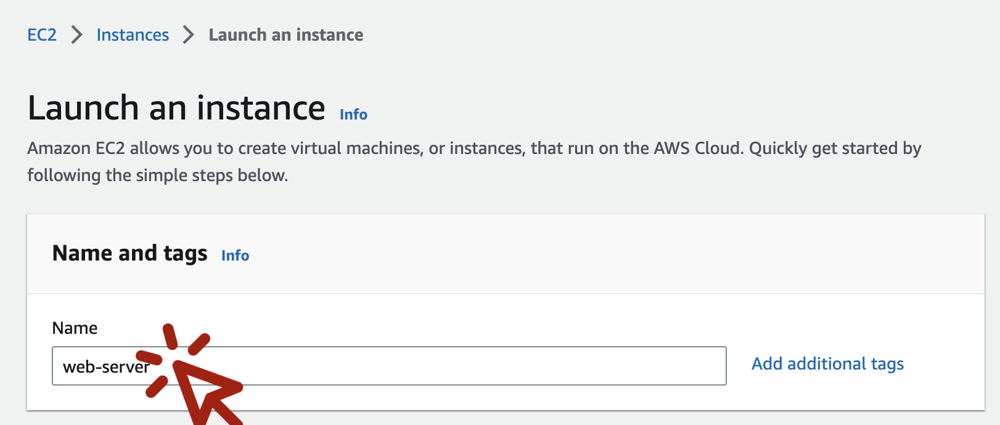
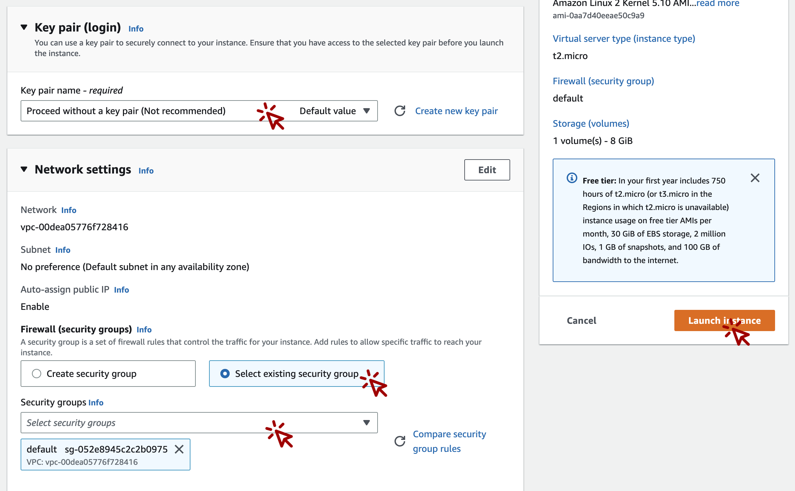
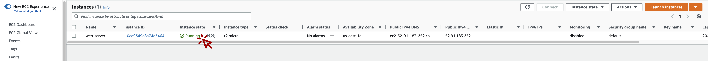
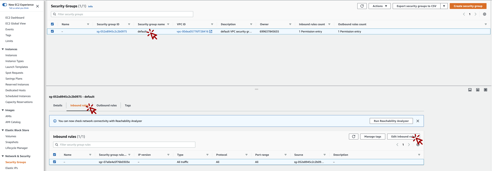
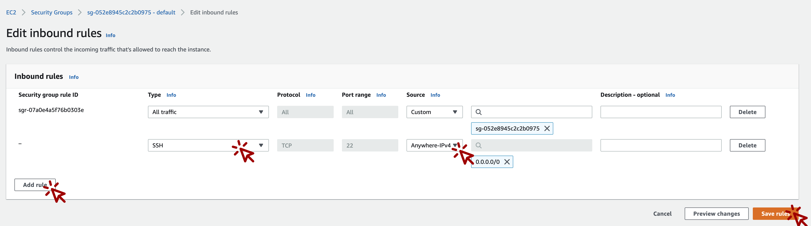

# 1. 개요
Nginx의 Log를 수집하여 Glue Streaming을 통해 실시간으로 s3로 전송하는 것을 목적으로 합니다.

# 2. 기능
...

# 3. 아키텍처

## 1. WEB 서버 생성
***
ec2 페이지로 이동[(바로가기)](https://ap-northeast-2.console.aws.amazon.com/ec2/home?region=ap-northeast-2#Instances)하여 WEB서버를 생성합니다.

***
Name 에 `web-server` 를 입력합니다.

***
Key pair 에 `Proceed without a key pair` 를 선택, 
Network setting 에서 Firewall 에 `Select existing security group` 선택, 
Security groups 에 `default` 체크, 
그리고 `Launch instance` 버튼을 누릅니다.

***
ec2 페이지로 이동[(바로가기)](https://ap-northeast-2.console.aws.amazon.com/ec2/home?region=ap-northeast-2#Instances)하여 방금 생성한 web-server의 instance state가 Running 상태가 될 때까지 기다립니다.

***

생성된 ec2 의 ssh 접근을 위해 보안 그룹 페이지로 이동[(바로가기)](https://us-east-1.console.aws.amazon.com/ec2/home?region=us-east-1#SecurityGroups:) 하여  
Securty group name 이 `default`인 보안 그룹을 클릭, 
하단의 `inbound rules` 을 클릭, 
`Edit inbound rules` 를 클릭합니다.

***

Edit inbound rules 화면에서  
`Add rule` 버튼 클릭,  
Type 에 `ssh` 선택,  
Source 에 `Anywhere-IPv4` 를 선택,  
`Save rules` 버튼을 클릭합니다.

